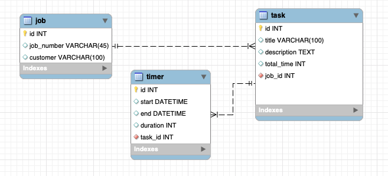

# EventTrackerProject

### Full Stack Spring/REST project for Skill Distillery

## Overview
This application is built with the intent of allowing users to track time spent on completing tasks related to a job and/or customer. This application is ideal for users who need to keep track of time for billing purposes or budgeting purposes.

## How to Run
Upon arrival to the site, the user is given access to the options of viewing all jobs, searching jobs by customer or job number, or creating a new job. If the user chooses to search or view all jobs, each job result will be displayed with buttons allowing the user to edit the details of that job, delete the job, or view all of the tasks associated with that job. (Note: If delete is chosen, the job and all associated tasks and timers will be deleted permanently.)

If the user chooses to view all of the tasks, any tasks that exist are displayed with buttons allowing the user to edit the details of the task, delete the task, or view all of the timers associated with that task. Additionally, the user has the option to create a new task. (Note: If delete is chosen, the task and all associated timers will be deleted permanently.)

If the user chooses to view all of the timers, any timers that exist are displayed with buttons allowing the user to edit the timer or delete the timer. The user also has the option of creating a new timer. When a timer is created or updated, the task's total time will also be updated to reflect the total of all timers associated with that task. (Note: deleting a timer is permanent.)

When creating a new timer, the user is provided buttons for starting, stoping, and saving the time. Start and stop work like a stopwatch. Start the timer when you begin working on a task and stop the timer when you are complete or taking a break. After stopping the timer, save the time to apply it to the task.

Notes about the data hierarchy:
1) All timers must belong to a task.
2) All tasks must belong to a job.
3) A tasks total time is calculated based on the sum of its timers durations.
4) Jobs are for organizational purposes to keep track of multiple tasks.

## REST Endpoints

| CRUD Op. | HTTP Verb | URI                  | Request Body | Response Body |
|----------|-----------|----------------------|--------------|---------------|
| Read     | GET       | `/api/jobs`            |                                                                       | Collection of representations of all Jobs. Status: 200 - Ok |
| Read     | GET       | `/api/jobs/{jobId#}`     |                                                                       | Representation of Job w/ jobId#. Status: 200 - Ok, 404 - Not Found |
| Read     | GET       | `/api/jobs/search/customer/{keyword}`            |                                                                       | Collection of representations of all Jobs that contain the keyword within the customer field. Status: 200 - Ok |
| Read     | GET       | `/api/jobs/search/jobnumber/{keyword}`            |                                                                       | Collection of representations of all Jobs that contain the keyword within the jobNumber field. Status: 200 - Ok |
| Create   | POST      | `/api/jobs`            | Representation of a new Job                                           | Representation of newly created Job. Status: 201 - Created, 400 - Bad Request|
| Update   | PUT       | `/api/jobs/{jobId#}`     | Representation of a new version of Job w/ jobId#                      | Representation of updated Job w/ jobId#. Status: 200 - Ok, 404 - Not Found, 400 - Bad Request|
| Delete   | DELETE    | `/api/jobs/{jobId#}`     |                                                                       | Status: 204 - No Content, 404 - Not Found |
| Read     | GET       | `/api/tasks`           |                                                                       | Collection of representations of all Tasks. Status: 200 - Ok  |
| Read     | GET       | `/api/tasks/{taskId#}`   |                                                                       | Representation of Task w/ taskId#. Status: 200 - Ok, 404 - Not Found  |
| Read     | GET       | `/api/tasks/search/job/{jobId#}`   |                                                                       | Collection of representations of all tasks that belong to the job with jobId#. Status: 200 |
| Create   | POST      | `/api/tasks`           | Representation of a new Task                                          | Representation of newly created Task. Status: 201 - Created, 400 - Bad Request |
| Update   | PUT       | `/api/tasks/{taskId#}`   | Representation of a new version of Task w/ taskId#                    | Representation of updated Task w/ taskId#. Status: 200 - Ok, 404 - Not Found, 400 - Bad Request|
| Delete   | DELETE    | `/api/tasks/{taskId#}`   |                                                                       | Status: 204 - No Content, 404 - Not Found |
| Read     | GET       | `/api/timers`          |                                                                       | Collection of representations of all Timers. Status: 200 - Ok  |
| Read     | GET       | `/api/timers/{timerId#}` |                                                                       | Representation of Timer w/ timerId#. Status: 200 - Ok, 404 - Not Found  |
| Read     | GET       | `/api/timers/search/task/{taskId#}`   |                                                                       | Collection of representations of all timers that belong to the task with taskId#. Status: 200 |
| Create   | POST      | `/api/timers`          | Representation of a new Timer                                         | Representation of newly created Timer. Status: 201 - Created, 400 - Bad Request |  
| Update   | PUT       | `/api/timers/{timerId#}` | Representation of a new version of Timer w/ timerId#                  | Representation of updated Timer w/ timerId#. Status: 200 - Ok, 404 - Not Found, 400 - Bad Request|
| Delete   | DELETE    | `/api/timers/{timerId#}` |                                                                       | Status: 204 - No Content, 404 - Not Found |

## Database Schema

## Technologies Used
* Java
* Spring Data JPA
* Spring REST
* Angular
* Typescript
* HTML
* Bootstrap
* CSS
